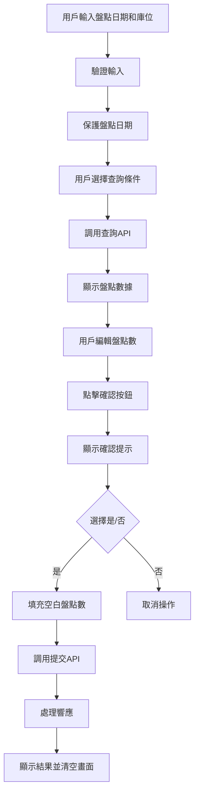

# 盤點資料建檔系統架構設計

## 專案概述
製作盤點系統的盤點資料建檔功能，支援桌面和手機端操作。

## 系統架構

### 整體架構圖
```
┌─────────────────┐    ┌─────────────────┐    ┌─────────────────┐
│   前端界面      │    │   模擬API服務   │    │   數據存儲      │
│   (HTML/JS)     │◄──►│   (Node.js)     │◄──►│   (JSON文件)    │
└─────────────────┘    └─────────────────┘    └─────────────────┘
         │
         ▼
┌─────────────────┐
│   手機端優化    │
│   (響應式設計)  │
└─────────────────┘
```

### 技術棧
- **前端**: HTML5, CSS3, JavaScript (ES6+)
- **後端**: Node.js + Express (模擬API)
- **數據存儲**: JSON文件 (模擬數據庫)
- **手機支援**: 響應式設計 + 條碼掃描

## 數據流程圖



## 功能需求

### 前端功能
1. **輸入驗證**
   - 盤點日期 (dInventoryDate) 格式驗證
   - 盤點庫位 (cWhIdn) 存在性驗證
   - 驗證通過後保護盤點日期

2. **查詢條件**
   - 起訖料架位 (cBinBegin, cBinEnd)
   - 起訖盤點編號 (cInvNoBegin, cInvNoEnd)
   - 零件件號 (鍵盤輸入或條碼掃描)

3. **數據顯示**
   - 盤點編號 (cInvSNo)
   - 零件件號 (cPartsIdn)
   - 品名 (cCName)
   - 月結堪用量 (nQtyAvailable)
   - 本次盤點數 (nActualInvQty) - 可編輯

4. **確認操作**
   - 提示用戶確認操作
   - 自動填充空白盤點數為月結堪用量
   - 調用提交API
   - 處理響應並清空畫面

### API設計

#### 1. 獲取盤點數據 API
- **端點**: `GET /api/inventory-data`
- **參數**:
  ```json
  {
    "queryType": "bin|invNo|parts",
    "cBinBegin": "string",
    "cBinEnd": "string",
    "cInvNoBegin": "string",
    "cInvNoEnd": "string",
    "cPartsIdn": "string"
  }
  ```
- **返回**:
  ```json
  [
    {
      "cInvSNo": "盤點編號",
      "cPartsIdn": "零件件號",
      "cCName": "品名",
      "nQtyAvailable": 100,
      "nActualInvQty": null
    }
  ]
  ```

#### 2. 提交盤點數據 API
- **端點**: `POST /api/submit-inventory`
- **請求體**:
  ```json
  {
    "dInventoryDate": "2024-01-01",
    "cWhIdn": "倉庫編號",
    "inventoryData": [
      {
        "cInvSNo": "盤點編號",
        "nActualInvQty": 95
      }
    ]
  }
  ```
- **返回**:
  ```json
  {
    "status": true,
    "message": "紀錄完成"
  }
  ```

## 前端組件結構

### HTML結構
```html
<div class="inventory-container">
  <!-- 輸入區域 -->
  <div class="input-section">
    <div class="form-group">
      <label>盤點日期:</label>
      <input type="date" id="inventoryDate">
    </div>
    <div class="form-group">
      <label>盤點庫位:</label>
      <input type="text" id="warehouseId">
    </div>
  </div>

  <!-- 查詢條件區域 -->
  <div class="query-section">
    <!-- 料架位查詢 -->
    <div class="query-option">
      <h3>依料架位查詢</h3>
      <input type="text" placeholder="起點料架位">
      <input type="text" placeholder="終點料架位">
    </div>
    <!-- 其他查詢選項 -->
  </div>

  <!-- 數據顯示區域 -->
  <div class="data-section">
    <table id="inventoryTable">
      <thead>
        <tr>
          <th>盤點編號</th>
          <th>零件件號</th>
          <th>品名</th>
          <th>月結堪用量</th>
          <th>本次盤點數</th>
        </tr>
      </thead>
      <tbody></tbody>
    </table>
  </div>

  <!-- 操作按鈕 -->
  <div class="action-section">
    <button id="queryBtn">查詢</button>
    <button id="confirmBtn">確認</button>
  </div>

  <!-- 提示區域 -->
  <div id="messageArea"></div>
</div>
```

## 手機端優化

### 響應式設計
- 使用CSS Grid和Flexbox實現響應式佈局
- 媒體查詢適配不同螢幕尺寸
- 觸控友善的按鈕尺寸 (最小44px)

### 條碼掃描功能
- 整合手機相機API進行條碼掃描
- 自動提取條碼內容並轉換為大寫
- 支援主流條碼格式 (QR Code, Code 128等)

### 用戶體驗優化
- 優化輸入框尺寸和間距
- 改善表格在小螢幕上的滾動體驗
- 添加適當的視覺回饋和動畫效果

## 實施計劃

1. **建立模擬API服務** (Node.js/Express)
2. **設計響應式HTML界面佈局**
3. **實現輸入驗證邏輯**
4. **實現查詢條件處理**
5. **實現條碼掃描功能**
6. **實現API數據獲取和顯示邏輯**
7. **實現數據編輯功能**
8. **實現確認按鈕和提示邏輯**
9. **實現數據提交API調用**
10. **實現響應處理和畫面清空**
11. **添加手機端優化**
12. **實現錯誤處理和用戶提示**
13. **測試各項功能和手機兼容性**

## 數據結構

### 模擬數據庫結構
```json
{
  "warehouses": [
    {
      "cWhIdn": "WH001",
      "cWhName": "主要倉庫"
    }
  ],
  "inventoryItems": [
    {
      "cInvSNo": "INV001",
      "cPartsIdn": "PART001",
      "cCName": "測試零件",
      "cBin": "A01",
      "nQtyAvailable": 100
    }
  ]
}
```

## 測試計劃

### 功能測試
- 輸入驗證測試
- API調用測試
- 數據顯示測試
- 編輯功能測試
- 確認操作測試

### 兼容性測試
- 桌面瀏覽器測試 (Chrome, Firefox, Safari, Edge)
- 手機瀏覽器測試 (iOS Safari, Android Chrome)
- 不同螢幕尺寸測試

### 性能測試
- 大量數據載入測試
- 網路延遲模擬測試
- 記憶體使用量測試

---

## 開發紀錄 (2025-09-18)

- [x] **分析現有專案**
    - [x] 檢視 `plan.md` 了解專案目標。
    - [x] 檢視 `index.html` 和 `script.js` 確認現有功能為模擬掃描。
- [x] **實作真實條碼掃描功能**
    - [x] 於 `index.html` 引入 `html5-qrcode` 函式庫。
    - [x] 於 `index.html` 新增掃描器 `div` 容器。
    - [x] 於 `style.css` 添加掃描介面的彈出層樣式。
    - [x] 於 `script.js` 將模擬掃描替換為 `html5-qrcode` 的真實相機掃描邏輯。
- [x] **優化與修正**
    - [x] 考量嵌入式環境（WebView/iframe），修改 `script.js` 的掃描設定以提升相容性。
    - [x] 根據最佳實踐，為 `index.html` 中所有的 `<button>` 元素加上 `type="button"` 屬性。
    - [x] 使用 IIFE 重構 `script.js`，避免全域作用域汙染。
- [x] **錯誤修正**
    - [x] 調整 `index.html` 結構，修正掃描視窗在初始載入時意外顯示的問題（第一、二次嘗試）。
    - [x] 透過強化 CSS `!important` 規則並統一 JavaScript 顯示邏輯，徹底解決掃描視窗的初始顯示問題（第三次嘗試）。
    - [x] 透過覆寫 `script.js` 的方式，根除頑固的 `SyntaxError` 語法錯誤。
    - [x] 透過瀏覽器進行最終驗證，確認所有功能恢復正常。