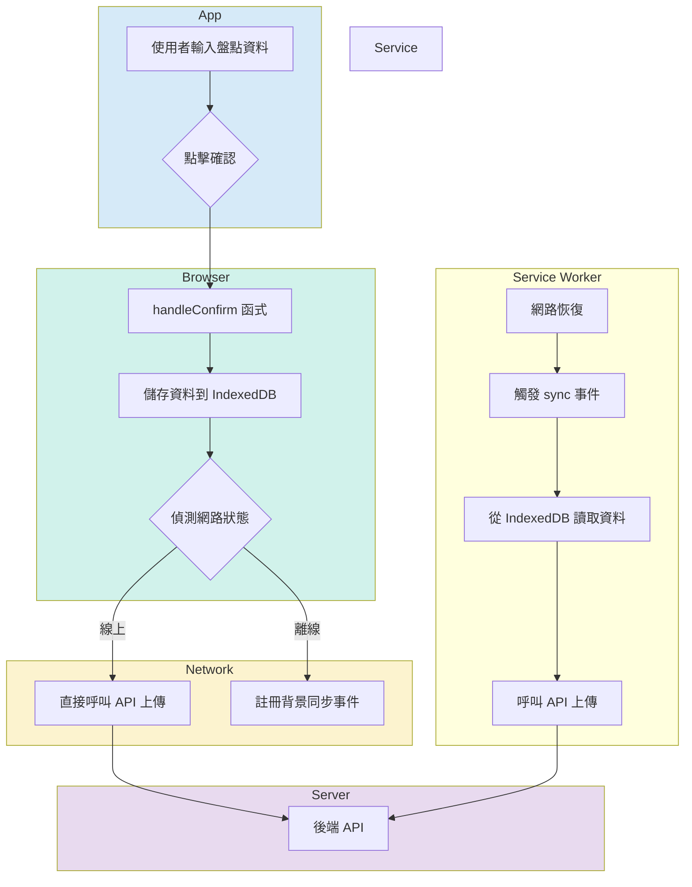

# 盤點系統開發計畫

## 功能

- [x] 初始頁面，包含盤點日期和庫位輸入
- [x] 檢查日期與庫位是否存在
- [ ] 根據不同條件查詢盤點資料 (儲位、盤點單號、料號)
- [ ] 顯示查詢結果
- [ ] 掃描條碼功能
- [ ] 輸入實際盤點數量
- [ ] 提交盤點資料
- [ ] **離線儲存功能**

## 離線功能開發計畫

### 執行計畫

1.  **建立 Service Worker (`sw.js`)**: 建立一個新檔案 `sw.js`，用來攔截網路請求。
2.  **註冊 Service Worker**: 在 `script.js` 中註冊 `sw.js`。
3.  **建立 IndexedDB 資料庫**: 在 `script.js` 中加入建立 IndexedDB 資料庫的邏輯，用來儲存離線盤點資料。
4.  **修改資料儲存邏輯**: 修改 `handleConfirm` 函式，將資料優先存入 IndexedDB。
5.  **顯示網路狀態**: 在 UI 上新增一個指示器，顯示線上/離線狀態。
6.  **背景同步**: 使用 Service Worker 的 `sync` 事件，在網路恢復時，將 IndexedDB 的資料上傳到後端 API。
7.  **修改 API 邏輯**: 調整 `script.js` 中的模擬 API，以處理來自 Service Worker 的背景同步請求。

### 流程圖

## 變更紀錄

- 2025-09-24: 修正 `script.js` 中 `handleCheckDateAndWarehouse` 函式的驗證邏輯錯誤，將 `isValid === 'true'` 修改為 `isValid === true`。
- 2025-09-24: 調整 `showMessage` 函式：
    - 當訊息類型為 'success' 或 'info' 時，隱藏「關閉」按鈕。
    - 將 'success' 和 'info' 訊息的顯示時間從 2000ms 縮短為 500ms。
- 2025-09-24: 在 `index.html` 中，為 `dialog-close` 按鈕添加 `type="button"` 屬性，以防止意外的表單提交。
